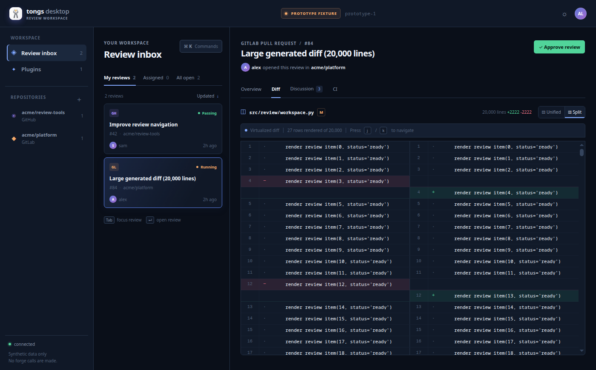
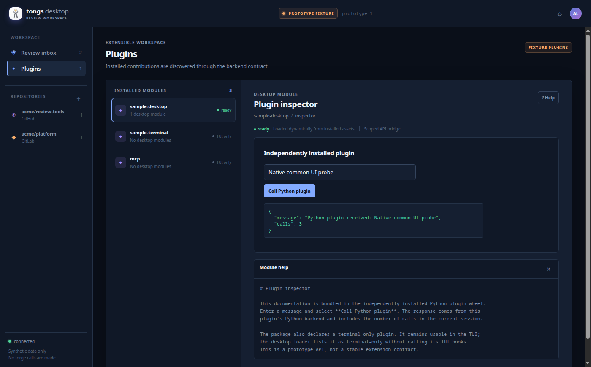
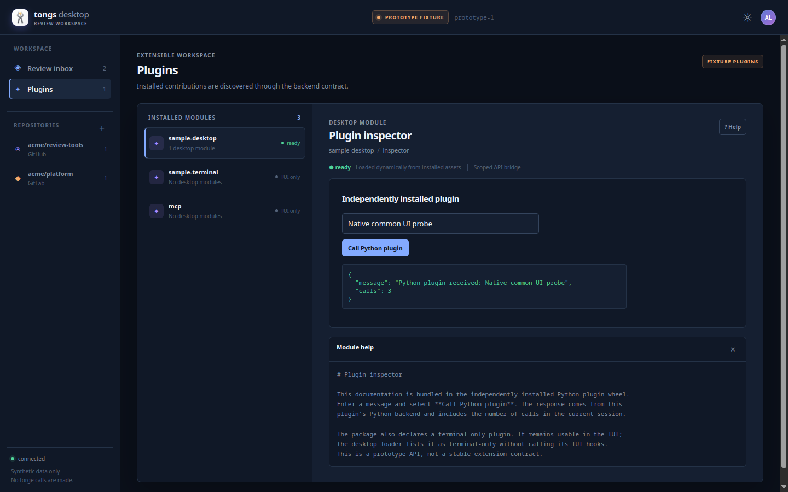

# Desktop comparison acceptance evidence

Tested application commit: `02ad69685f8511bcd7945a26650f3e2de2e6c908`.
Date: 2026-09-07. This is a fixture-only comparison, not a production release.
The later evidence/documentation commit does not change application code.

## Functional results

Both applications launched from locally built, non-editable wheels outside the
source checkout. The same environment contained the separately built Tongs core
and `tongs-desktop-sample` 0.0.1 plugin. Installed modules and frontend resources
resolved from `site-packages`. The webview environment deliberately exposes the
host's system PySide6/Qt packages; this is not proof of a self-contained download.

The shared native renderer probe passed in both shells: real Python bridge,
20,000-line diff, bounded rendered rows, scrolling to the final row, scroll reset,
split view, keyboard focus, light/dark themes, dynamically imported plugin UI,
Python plugin calls, DOM unmount/remount, and bundled help. The backend suite
also passed terminal-only hook sentinels: desktop loading never invokes those
legacy TUI hooks. The separate frontend unit test verifies cleanup-callback execution; DOM removal alone does not prove it.
All review data and plugin operations are synthetic. No live forge credentials,
comments, approvals, pipeline operations, or system package changes were used.

The [machine-readable result](results.json) retains input hashes, wheel hashes,
versions and measurements without personal paths. All four rebuilt wheels were
checked for absent `__pycache__`, `.pyc`, and `.pyo` entries. The existing website
icon was copied unchanged into both native distributions and the frontend.

| Observation | Electron | Python webview |
| --- | --- | --- |
| Runtime | Electron 44.2.0 / Chromium 152 | pywebview 6.2.1 / PySide6 6.11.2 / QtPy 2.4.3 |
| Native display | Wayland | Wayland, Qt WebEngine |
| GPU setting | `--disable-gpu` required in observed host runs | Default, no GPU override |
| Renderer sandbox | Enabled | Enabled |
| Host wheel | 131,991,833 bytes | 3,755,466 bytes, excludes system Qt |
| Host installed package | 291 MiB | 4.4 MiB, excludes system Qt |
| Process-tree RSS | Peak sample 943,736 KiB, 10 processes | Steady sample 895,228 KiB, 5 processes |
| Process-tree PSS | Peak sample 455,585 KiB | Not measured |
| Large diff render observation | 42.2 ms, 27 DOM rows | 39.4 ms, 28 DOM rows |
| Shutdown | Exit 0; observed Electron and backend PIDs exited | Exit 0; asset server stopped; captured process tree exited |

RSS sums can count shared pages repeatedly. Sampling methods and window sizes
differ, and these single synthetic runs are not a performance ranking. The Qt
runtime is substantial: the observed installed Fedora package payloads included
290,845,397 bytes for Qt WebEngine, 57,480,479 for PySide6, and 470,515 for
WebChannel, excluding other transitive dependencies. The tiny host wheel does
not represent the total download or installed footprint.

The Electron `startup_ms` value of 860.8 includes a fixed 750 ms evidence delay
before direct bridge checks. Webview's 1,280.6 ms includes its full renderer
probe. They measure different events and must not be compared as startup speed.
Wall times include evidence collection and deliberate holds. Repeatable startup
benchmarks with a common endpoint are future work if needed to decide the shell.

## Screenshots from the actual applications

Electron review workspace after the common probe:



Electron plugin, Python response and packaged help:



Python webview plugin, Python response and packaged help:



The captures contain only each application's own content. The Electron diff
capture reran the full probe then selected the large split diff. Controls for
unsupported production actions are disabled; their visual presence is not proof
that those actions exist. Screens were visually inspected after capture.

## Checks and reviews

| Check at the tested code | Result |
| --- | --- |
| Core regression suite | 618 passed with MCP 1.29.1 |
| Shared Python fixture/plugin/sidecar tests | 7 passed |
| React frontend tests and build | 10 passed; TypeScript and Vite build passed |
| Electron tests including real local sidecar | 10 passed |
| Webview tests including timeout recovery | 14 passed |
| New Python lint and formatting | Passed, 17 files |
| Locked frontend/Electron npm dependency audits | Zero reported vulnerabilities at this run |
| Desktop entry and AppStream inputs | Passed independent validation |
| Strict MkDocs build and diff whitespace | Passed |
| Existing core Ruff lint and formatting | Unmet baseline: 157 findings, 4 files need formatting |

Reproduction from the integration checkout uses its development environment:

```bash
PYTHONPATH=spikes/desktop .venv/bin/pytest -q tests spikes/desktop/tests
cd spikes/desktop/frontend
npm ci --ignore-scripts
npm test
npm run build
```

Use the [Electron instructions](../electron/README.md) and
[webview instructions](../webview/README.md) for their package builds and native
capture commands, passing the same built `frontend/dist` and
`tests/common_ui_probe.js`. Build core and reference-plugin wheels from this
commit, then install those local wheels with both host wheels into a disposable
environment. Disable Python user-site discovery for the installed proof.

The core optional `mcp` constraint currently permits MCP 2, which removed the
FastMCP import used by Tongs and caused five misleading skips in the initial
environment. Pinning MCP 1.29.1 only in the validation environment allowed all
618 tests to execute. Production dependencies were not changed. Initial combined
test collection also needed the prototype's documented `PYTHONPATH` above; its
corrected run passed all 625 Python tests. The final Electron build was retried
after removing superseded generated build copies that exhausted temporary-space
quota. These failures and the unresolved baseline checks are not hidden passes.

Independent Sol reviews approved the foundation, Luna frontend and correction,
website icon, shared probe, both Sol shell authors, and the subsequent minimum
width/bytecode/timeout corrections. A final independent Sol assessment approved
the comparison/evidence record, with its terminal-only sentinel clarification
incorporated. The first frontend review required changes
to error reporting and keyboard hints; those findings were fixed and re-reviewed.

## Limits, recovery and next actions

Only the approved Fedora 44 KDE x86_64 host was tested. Both windows enforce a
960-pixel minimum, matching the frontend's declared constraint; screenshots
exercise larger viewports, not a full resize/accessibility audit. Native key-event
delivery, screen-reader support, full workflow parity and real forge operations
remain production work. The plugin screen supports the first module only in this
spike. Desktop plugin APIs remain experimental.

Electron needs a graphics decision and repeat validation on this host before a
production release. Webview's navigation/origin/CSP gap blocks real forge content
or mutations. Installed Python plugins are trusted code in both candidates.
Neither successful fixture run approves a production security boundary.

Host SELinux was verified as Enforcing after both installed native runs; the
host's setroubleshoot journal showed no new alert during that interval. The
reported `/source/tests/__init__.py` denial was traced to a different task's
container validation, not either Tongs desktop process. No SELinux policy was
changed for this comparison.

All changes remain on the isolated `codex/desktop-prototype` branch. The dirty
main checkout is preserved, so promotion is pending. Issues stay open. Recovery
is to retain these worktrees for corrections or discard only generated artifacts;
no production state migration or rollback is needed for the fixture spike.

The next design gate selects the shell and approves production service/plugin,
draft/diff and distribution contracts. The proposed GitHub Releases installer
and eventual RPM have not been implemented or published. A review-branch push
and PR containing the accepted commits is the proposed upstream action after
CTO acceptance; merge, release and deployment require their own authority.
