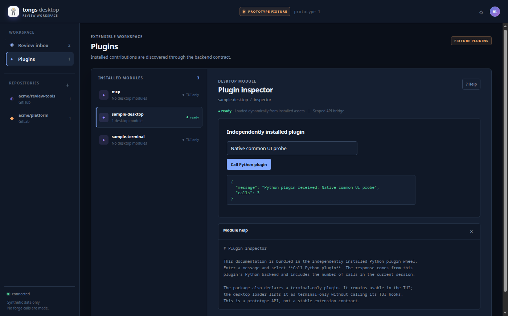
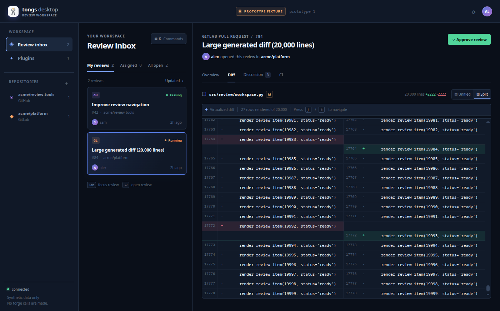

# Electron hardware GPU spike

Issue [#25](https://github.com/andre-motta/tongs/issues/25) investigates the
mandatory hardware GPU gate for Electron 44.2.0 on Fedora 44 KDE x86_64. The
exact application candidate is `84871802543426d093522bd543ce9718941bb684`.
This report contains native installed-application evidence, not a browser mock.

## Result

The candidate passes the spike gate on the tested KDE Wayland session by using
XWayland (`--ozone-platform=x11`). The launcher selects that backend before
Electron starts when `XDG_SESSION_TYPE=wayland`, unless the user supplies an
explicit Ozone override. It does not pass `--disable-gpu`, `--no-sandbox`, or a
GPU or seccomp sandbox-disabling switch.

Five consecutive launches of the non-editable installed wheels exited with
status 0. Every run completed the real Python bridge and common renderer probe,
including the 20,000-line virtual diff, final-row scrolling, split diff, focus,
both themes, plugin mount, navigation-driven unmount and remount, Python plugin
invocation, and bundled help. All five reports contained an empty child-process
failure list.

Physical acceleration is established by combined evidence:

- Chromium reported hardware acceleration enabled, with GPU compositing,
  rasterization, OpenGL, and WebGL enabled.
- The active Chromium device was PCI `10de:2b85`, matching the host's discrete
  NVIDIA GeForce RTX 5090 reported by `lspci`, `vulkaninfo`, and `nvidia-smi`.
- The renderer exposed `ANGLE (NVIDIA Corporation, NVIDIA GeForce RTX
  5090/PCIe/SSE2, OpenGL 4.5.0)`, not SwiftShader, llvmpipe, or lavapipe.
- Electron exposed a separate GPU process. `/proc` reported `NoNewPrivs: 1`,
  `Seccomp: 2`, and one seccomp filter for both that process and the renderer.
- The renderer page had no `process` or `require` global and retained only the
  allowlisted Tongs bridge.

The machine-readable [results](results.json) contain exact versions, commits,
input and artifact hashes, GPU/device values, five run measurements, and the
assertion matrix.

## Diagnosis

The explicit native Wayland run opened a window and named the physical RTX 5090
for WebGL, but Chromium emitted its Wayland/Vulkan incompatibility error and the
GPU process had `Seccomp: 0`. That combination does not pass. Enabling the early
GPU sandbox caused EGL library access to fail inside the sandbox, followed by
repeated GPU process exits and Chromium disabling GPU access. Preloading the
existing system EGL library changed the first error but did not produce a
working sandboxed Wayland GPU process.

The XWayland launch removed the Wayland/Vulkan error and produced both the
physical renderer evidence and active GPU/renderer seccomp filters. It did emit
two nonfatal diagnostics during repeated runs: an oversized X request and a
failed Mesa probe for the secondary GPU's `dri_gbm.so`. Chromium consistently
selected the NVIDIA device, all accelerated checks passed, and no child process
failure event was observed.

An explicit XWayland `--disable-gpu --require-hardware-gpu` negative control
exited with status 1 after Electron reported GPU access disabled. It did not
produce an accepted evidence report. The unit-level verifier also rejects a
SwiftShader device and renderer plus an unsandboxed GPU process.

Electron's complete GPU object also reported `inProcessGpu: true` and
`sandboxed: false`, even while `app.getAppMetrics()` identified a separate GPU
PID and `/proc` showed its active seccomp filter. Because those fields conflict
with the observed process, the verifier does not use them as proof. It requires
the separate process, Linux security state, physical PCI device, hardware
feature statuses, and WebGL renderer together.

This is consistent with Electron's tracked
[Wayland GPU process issue](https://github.com/electron/electron/issues/50462),
which describes missing Wayland graphics state and a software compositing path.
Native Wayland remains unsupported by this spike result.

## Installed artifact proof

The candidate Tongs wheel, reference-plugin wheel, and Electron host wheel were
built locally, then installed into a fresh environment outside the checkout.
Python user-site discovery was disabled for every launch. Installed metadata
reported Tongs `0.4.2.dev17+g848718025`, reference plugin `0.0.1`, and Electron
prototype `0.0.1`. Entry-point discovery returned `mcp`, `sample-desktop`, and
`sample-terminal`; only `sample-desktop` exposed a desktop module, as expected.

The Electron wheel SHA-256 is
`7a630a2c83c26aabe45e26c49f8ce8e7d62fbfdb51cefb60da04855dd693f179`.
The installed Electron executable SHA-256 is
`9b827d38aacff0d69933481625c4c8f13b4732cbecd0e3477b1d2bac6102522c`.
The complete artifact set is recorded in [results.json](results.json).

Representative installed plugin workflow:



Installed 20,000-line split diff at its final row:



The `render_review_item(...)` lines in that screenshot are generated stress
data. They test diff parsing, split rendering, bounded DOM virtualization, and
scrolling through 20,000 lines. This prototype does not connect the desktop
bridge to a real repository or forge API. That integration remains later work
and must reuse the production core rather than treating fixture output as live
repository proof.

An earlier screenshot was blank even though the probe had found the final row
in the DOM. A DOM-ready assertion alone was therefore insufficient capture
evidence. The checked-in probe now requires the final row to have visible
viewport geometry, waits for two animation frames plus 100 ms, and only then
returns for capture. Three subsequent installed captures were visually
inspected and all showed rows 19,981 through 19,999; this report keeps one as
the representative image.

## Reproduction

From the candidate checkout, install the locked Electron runtime and run the
focused checks:

```bash
cd spikes/desktop/electron
npm ci
TONGS_DESKTOP_PYTHON=/path/to/test/python npm test
python -m pytest -q test/test_launcher.py
npm run smoke -- \
  --frontend ../frontend/dist \
  --python /path/to/installed/python \
  --ui-probe ../tests/common_ui_probe.js \
  --require-hardware-gpu \
  --report evidence/gpu.json \
  --screenshot evidence/gpu.png
```

Build the three wheels, install them into a fresh environment, change to a
directory outside the checkout, and run the installed launcher without an Ozone
argument:

```bash
PYTHONNOUSERSITE=1 /path/to/fresh/bin/tongs-electron-prototype \
  --ui-probe /path/to/common_ui_probe.js \
  --smoke-report /path/to/installed.json \
  --screenshot /path/to/installed.png
```

The generated report must have `ozone_platform: "x11"` and
`gpu.acceptance.passed: true`. Use
`scripts/large-diff-screenshot-probe.js` to leave the split diff visible for
capture. The exact build and frontend hashes are in [results.json](results.json).

## Scope and release status

The evidence uses synthetic review data and a local reference plugin. It makes
no live forge request or mutation. The host remained Fedora 44 KDE x86_64 with
SELinux Enforcing, NVIDIA driver 610.57.04, and no OS, driver, desktop, SELinux,
or sandbox configuration changes.

This result validates the bounded Electron 44.2.0 spike on one host. It does not
validate native Wayland, another driver or runtime, or a production release
artifact. The mandatory release gate must run again on the final distributable
and after relevant Electron, Chromium, driver, package, or graphics-launch
changes.
